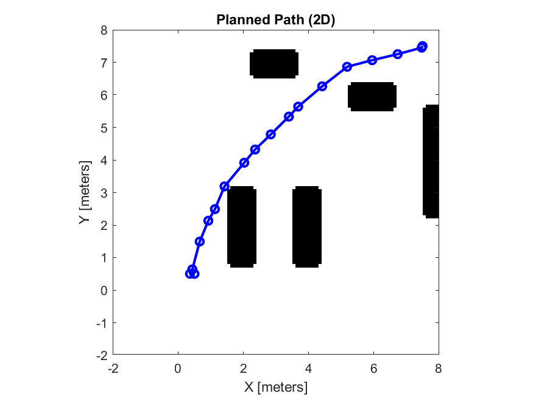
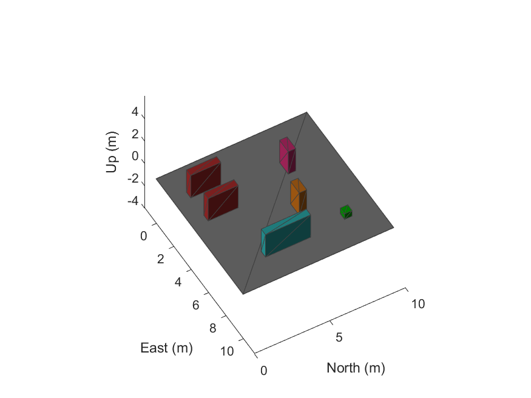

# MatLab_simulation
Motion planning simulation.

Objective: The purpose of this project is to simulate a mobile robot navigating through a complex environment filled with obstacles such as walls and shelves. The robot's goal is to travel from a starting position to a designated goal while avoiding collisions.

Environment Setup: The simulation environment consists of:

Ground plane
Obstacles (walls, shelves)
A binary occupancy map used for path planning
A loading point representing the goal
Path Planning Algorithm: A probabilistic roadmap (PRM) algorithm is used to find an efficient path from the start to the goal. The algorithm generates nodes and connects them to find a clear, obstacle-free path.

Robot Navigation: The robot, modeled after the Clearpath Husky, follows a pre-planned trajectory derived from the waypoints generated by the PRM. A waypointTrajectory system object controls the movement, and the simulation ensures the robot can stop upon reaching the goal.

3D and 2D Visualization: The robot's path is displayed in both 2D and 3D:

2D Map: Visualizes the binary occupancy grid and the robot’s movement plan.
3D View: Shows the robot navigating around the 3D environment in real-time.
Simulation Dynamics:

The robot’s speed can be adjusted, and the simulation updates at a frequency of 10 Hz.
The simulation stops automatically when the robot reaches its goal, as determined by a proximity threshold.
Conclusion: This simulation demonstrates how path planning and obstacle avoidance can be effectively managed using the PRM algorithm, real-time visualization, and trajectory control for a mobile robot in a constrained environment.

